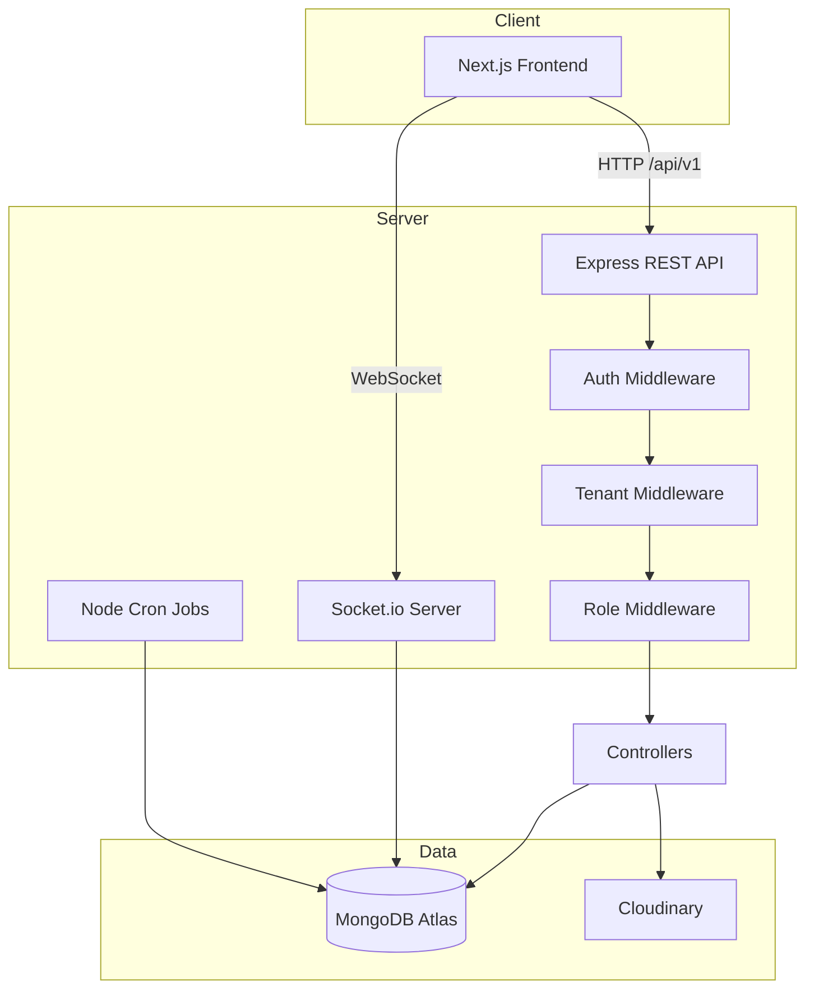

# Omnistack

**A multi-tenant SaaS workspace platform** for organizations to manage projects, tasks, members, files, and analytics — with strict data isolation and real-time collaboration.

Built as a **Week 5 Full-Stack Assignment**: *Multi-Tenant SaaS Platform* using Next.js, Express, Socket.io, MongoDB, and Cloudinary.

[](https://nextjs.org/)
[](https://react.dev/)
[](https://expressjs.com/)
[](https://socket.io/)
[](https://www.mongodb.com/)
[](https://cloudinary.com/)
[](https://www.typescriptlang.org/)
[](https://tailwindcss.com/)

**Repository:** [github.com/ayushsinha008/Multi-Tenant-SaaS-Platform](https://github.com/ayushsinha008/Multi-Tenant-SaaS-Platform)

---

## Table of Contents

- [About](#about)
- [Live Demo](#live-demo)
- [Features](#features)
- [Unique Highlights](#unique-highlights)
- [Tech Stack](#tech-stack)
- [Architecture](#architecture)
- [Project Structure](#project-structure)
- [Getting Started](#getting-started)
- [Environment Variables](#environment-variables)
- [Deployment](#deployment)
- [Real-Time & Collaboration](#real-time--collaboration)
- [Security](#security)
- [API Overview](#api-overview)
- [Testing Checklist](#testing-checklist)
- [Assignment Mapping](#assignment-mapping)
- [Author](#author)

---

## About

**Omnistack** is a production-style multi-tenant SaaS app where teams collaborate inside isolated organizations. Users register, create or join workspaces, and work together on:

- **Projects & tasks** — Kanban-style boards with priorities and due dates
- **Members & roles** — Admin and Member RBAC per organization
- **Files** — Cloudinary-backed uploads and attachments
- **Analytics** — dashboard overview cards and progress charts
- **Activity & notifications** — audit trail of what changed and who did it
- **Plans** — subscription plan awareness (FREE / PRO / ENTERPRISE)

The backend uses **JWT authentication** (access + refresh tokens), **Socket.io** for live updates, **MongoDB** for persistence, and **tenant middleware** (`x-tenant-id`) for strict organization isolation.

---

## Live Demo

| Service | URL |
|---------|-----|
| Frontend (Vercel) | `https://your-app.vercel.app` *(update after deploy)* |
| Backend API (Render) | `https://your-backend.onrender.com/api/v1` *(update after deploy)* |
| Health Check | `GET /api/health` → `{ "status": "ok" }` |

> After deploying, replace the placeholder URLs above and in your GitHub **About** section.

---

## Features

### Core (Assignment Requirements)

| Feature | Description |
|---------|-------------|
| **Multi-Tenant Architecture** | Full data isolation via `organizationId` + `x-tenant-id` middleware |
| **User Authentication** | JWT login/register with refresh tokens and HTTP-only cookies |
| **Role-Based Access Control** | Admin / Member permissions per organization |
| **Real-Time Collaboration** | Socket.io for live task updates, typing indicators, and notifications |
| **CRUD Operations** | Organizations, projects, tasks, members, files, comments |
| **Activity Tracking** | Audit logs for critical workspace actions |
| **Data Persistence** | MongoDB stores users, orgs, projects, tasks, files, notifications |

### Workspace Tools

- Neo-Brutalist dashboard UI (responsive, dark-mode ready)
- Project management with search and pagination
- Task board — status, priority, assignees, due dates
- Member invites (email + join codes) and role management
- File uploads via Cloudinary
- Analytics overview for workspace activity
- Global search across projects and tasks
- Command palette for quick navigation
- Activity feed + in-app notifications
- Plans / billing page (PayU-ready mock integration)

### Bonus Features

| Feature | Status |
|---------|--------|
| Google OAuth login | Supported |
| Refresh token rotation | Access + refresh JWT cookies |
| Background jobs | Node Cron for scheduled tasks |
| File attachments | Cloudinary + Multer |
| Analytics dashboard | Charts and overview cards |
| Docker Compose | Full stack (MongoDB, Redis, server, web) |

---

## Unique Highlights

### Tenant Isolation Middleware
Every protected resource is scoped by `organizationId`. The `requireTenant` middleware reads `x-tenant-id` and verifies membership before any controller runs — so one org can never read another org’s data.

### Neo-Brutalist UI
A custom cream / ink / lavender design system with bold borders, neo shadows, and Framer Motion — built for a playful but production-ready feel.

### Workspace Switching
Users can belong to multiple organizations and switch the active workspace from the topbar without re-logging in.

---

## Tech Stack

| Layer | Technology |
|-------|------------|
| **Frontend** | Next.js 16, React 19, TypeScript, Tailwind CSS 4, Framer Motion, Zustand, TanStack Query |
| **Backend** | Node.js, Express 4, TypeScript, Socket.io 4 |
| **Database** | MongoDB Atlas + Mongoose |
| **Auth** | JWT (access + refresh) + bcrypt + Google OAuth |
| **File storage** | Cloudinary + Multer |
| **Jobs** | Node Cron |
| **Monorepo** | pnpm workspaces |
| **Deploy** | Vercel (frontend) + Render (backend) |

---

## Architecture



**Tenant flow example (create task):**
1. Client sends `POST /api/v1/tasks` with JWT cookie + `x-tenant-id` header
2. Auth middleware verifies the access token
3. Tenant middleware checks the user is a member of that organization
4. Role middleware ensures Admin or Member can create
5. Task is saved with `organizationId` — Socket.io can emit updates to the org room

---

## Project Structure

```
Multi-Tenant-SaaS-Platform/
├── apps/
│   ├── server/                 # Express API + Socket.io
│   │   ├── src/
│   │   │   ├── config/         # DB connection
│   │   │   ├── controllers/    # Route handlers
│   │   │   ├── cron/           # Scheduled jobs
│   │   │   ├── middleware/     # Auth, tenant, role, errors
│   │   │   ├── models/         # Mongoose schemas
│   │   │   ├── routes/         # API routes
│   │   │   ├── services/       # Activity log service
│   │   │   ├── socket/         # Socket.io manager
│   │   │   ├── utils/          # JWT helpers
│   │   │   └── validators/     # Zod schemas
│   │   └── Dockerfile
│   │
│   └── web/                    # Next.js App Router
│       ├── src/
│       │   ├── app/            # Pages (auth, dashboard)
│       │   ├── components/     # UI + layout components
│       │   ├── hooks/          # Custom hooks
│       │   ├── lib/            # Axios, utilities
│       │   └── store/          # Zustand stores
│       └── Dockerfile
│
├── packages/
│   └── tsconfig/               # Shared TypeScript config
├── docker/                     # Docker build files
├── docs/                       # Architecture, ER, deployment, Postman
├── scripts/                    # Helper scripts
├── docker-compose.yml
├── .env.example
└── README.md
```

---

## Getting Started

### Prerequisites

- Node.js 20+
- pnpm 9+
- MongoDB Atlas account (or local MongoDB)
- Cloudinary account (for file uploads)

### 1. Clone the repository

```bash
git clone https://github.com/ayushsinha008/Multi-Tenant-SaaS-Platform.git
cd Multi-Tenant-SaaS-Platform
```

### 2. Install dependencies

```bash
pnpm install
```

### 3. Configure environment

```bash
cp .env.example .env
# Edit .env with your real values (never commit .env)
```

Also copy values into `apps/server/.env` and `apps/web/.env.local` if you run apps separately.

### 4. Start development servers

```bash
pnpm dev
```

- Frontend → **http://localhost:3000**
- Backend → **http://localhost:5000**

### 5. Verify

- Open http://localhost:3000
- Register a new account
- Create an organization (workspace)
- Explore projects, tasks, members, and analytics

### Docker (optional)

```bash
docker-compose up -d --build
```

---

## Environment Variables

> **Never commit `.env` files.** Only `.env.example` with placeholders is in the repo.

### Backend (`apps/server` / root `.env`)

| Variable | Description |
|----------|-------------|
| `PORT` | Server port (default `5000`) |
| `NODE_ENV` | `development` or `production` |
| `FRONTEND_URL` | Frontend URL for CORS (e.g. `http://localhost:3000`) |
| `MONGODB_URI` | MongoDB Atlas connection string |
| `JWT_ACCESS_SECRET` | Secret for access tokens (32+ chars) |
| `JWT_REFRESH_SECRET` | Secret for refresh tokens (32+ chars) |
| `JWT_ACCESS_EXPIRES_IN` | Access token TTL (e.g. `15m`) |
| `JWT_REFRESH_EXPIRES_IN` | Refresh token TTL (e.g. `7d`) |
| `CLOUDINARY_CLOUD_NAME` | Cloudinary cloud name |
| `CLOUDINARY_API_KEY` | Cloudinary API key |
| `CLOUDINARY_API_SECRET` | Cloudinary API secret |
| `RATE_LIMIT_WINDOW_MS` | Rate limit window (default `900000`) |
| `RATE_LIMIT_MAX_REQUESTS` | Max requests per window (default `100`) |
| `SMTP_HOST` / `SMTP_PORT` / `SMTP_USER` / `SMTP_PASS` | Email for invitations (optional) |
| `REDIS_URL` | Redis URL for Socket.io scaling (optional) |

### Frontend (`apps/web/.env.local`)

| Variable | Description |
|----------|-------------|
| `NEXT_PUBLIC_API_URL` | Backend API URL (e.g. `http://localhost:5000/api/v1`) |
| `NEXT_PUBLIC_SOCKET_URL` | Socket.io server URL (e.g. `http://localhost:5000`) |
| `NEXT_PUBLIC_APP_URL` | Frontend app URL |
| `NEXT_PUBLIC_APP_NAME` | Display name (e.g. `Omnistack`) |

---

## Deployment

### Step 1 — Push to GitHub

```bash
git add .
git commit -m "your message"
git push origin master
```

### Step 2 — Deploy Backend (Render)

1. Go to [render.com](https://render.com) → **New Web Service** → connect GitHub
2. Select the **Multi-Tenant-SaaS-Platform** repo
3. Configure:
   - **Build Command:** `pnpm install && pnpm --filter @saas/server build`
   - **Start Command:** `pnpm --filter @saas/server start`
4. Add all backend env variables from the table above
5. Set `FRONTEND_URL` to your Vercel URL
6. Test: `https://YOUR-RENDER-URL/api/health`

### Step 3 — Deploy Frontend (Vercel)

1. Go to [vercel.com](https://vercel.com) → **Import Project** from GitHub
2. Set **Root Directory** → `apps/web`
3. Add environment variables:
   ```
   NEXT_PUBLIC_API_URL=https://YOUR-RENDER-URL/api/v1
   NEXT_PUBLIC_SOCKET_URL=https://YOUR-RENDER-URL
   ```
4. Click **Deploy**

### Step 4 — Connect Frontend & Backend

1. In Render, set:
   ```
   FRONTEND_URL=https://YOUR-VERCEL-URL.vercel.app
   ```
2. Redeploy both services if needed

### Step 5 — MongoDB Atlas

- **Network Access** → Allow `0.0.0.0/0` (required for Render cloud IPs)

More detail: [`docs/DEPLOYMENT.md`](docs/DEPLOYMENT.md)

---

## Real-Time & Collaboration

### Socket.io Events

| Event | Purpose |
|-------|---------|
| `join_workspace` / `leave_workspace` | Join/leave organization room |
| `join_project` / `leave_project` | Join/leave project room |
| `typing` / `stop_typing` | Live typing indicators in a project |

### How to test real-time

1. Open **two browsers** (or one normal + one incognito)
2. Log in as **two different users** in the **same organization**
3. Open the same project/task view
4. Test:
   - Start typing → other browser sees typing indicator
   - Update a task → refresh or live UI reflects the change
   - Check notifications after member/task actions

---

## Security

- **Helmet** — security HTTP headers
- **CORS** — restricted to `FRONTEND_URL` only
- **Rate limiting** — global API limit (configurable via env)
- **JWT** — access + refresh tokens; protected routes and profile APIs
- **RBAC** — Admin / Member checks on sensitive actions
- **Tenant auth** — membership verified via `x-tenant-id` on every org-scoped route
- **Password hashing** — bcrypt
- **Multer + Cloudinary** — controlled file uploads
- **Secrets** — all keys in `.env`, never in source code

---

## API Overview

Base path: `/api/v1`

| Method | Endpoint | Description |
|--------|----------|-------------|
| `POST` | `/auth/register` | Register a new user |
| `POST` | `/auth/login` | Login, get JWT cookies |
| `POST` | `/auth/google` | Google OAuth login |
| `POST` | `/auth/refresh-token` | Refresh access token |
| `GET` | `/auth/me` | Current user profile |
| `POST` | `/organizations` | Create organization |
| `POST` | `/organizations/join` | Join via invite code |
| `GET` | `/organizations` | List user's organizations |
| `GET` | `/projects` | List projects (tenant-scoped) |
| `GET` | `/tasks` | List tasks (tenant-scoped) |
| `POST` | `/tasks` | Create task |
| `GET` | `/members` | List org members |
| `POST` | `/files/upload` | Upload file to Cloudinary |
| `GET` | `/analytics` | Workspace analytics |
| `GET` | `/activity` | Activity / audit logs |
| `GET` | `/search` | Global search |
| `GET` | `/api/health` | Health check for deploy |

Most tenant-scoped routes require the `x-tenant-id` header. Full routes live in `apps/server/src/routes/`.

Postman collection: [`docs/postman_collection.json`](docs/postman_collection.json)

---

## Testing Checklist

- [ ] Register / login / logout
- [ ] Google OAuth login
- [ ] Create organization
- [ ] Join organization via invite code
- [ ] Switch between multiple workspaces
- [ ] Create, edit, delete projects
- [ ] Create, move, edit, delete tasks
- [ ] Invite member / change role / remove member
- [ ] Admin cannot orphan workspace by self-demotion
- [ ] Upload file attachment
- [ ] Analytics dashboard loads
- [ ] Activity feed updates after actions
- [ ] Notifications appear
- [ ] Global search finds projects/tasks
- [ ] Mobile layout (phone browser)
- [ ] Tenant isolation — user A cannot access org B data

---

## Assignment Mapping

| Requirement | Implementation |
|-------------|----------------|
| Multi-tenant data isolation | `organizationId` on models + `requireTenant` middleware |
| User Authentication (JWT) | Register, login, refresh tokens, Google OAuth |
| Role-based access control | Admin / Member via `requireRole` |
| Real-time collaboration | Socket.io workspace/project rooms + typing |
| CRUD for core resources | Orgs, projects, tasks, members, files |
| Activity / audit tracking | ActivityLog model + service |
| Analytics | Analytics routes + dashboard UI |
| Frontend: React/Next.js + Tailwind | Next.js 16 + Tailwind 4 (Neo-Brutalist) |
| Backend: Express + Socket.io | Express 4 + Socket.io 4 |
| Database: MongoDB | MongoDB Atlas + Mongoose |
| File uploads | Cloudinary + Multer |
| Background jobs | Node Cron |
| Deployment | Vercel + Render (+ Docker Compose) |

---

## Author

**Ayush Sinha**

- GitHub: [@ayushsinha008](https://github.com/ayushsinha008)
- Project: [Multi-Tenant-SaaS-Platform](https://github.com/ayushsinha008/Multi-Tenant-SaaS-Platform)

---

## License

This project was built as an academic assignment. All rights reserved by the author.

---

Omnistack — Ship together. Stay isolated. Scale faster.
