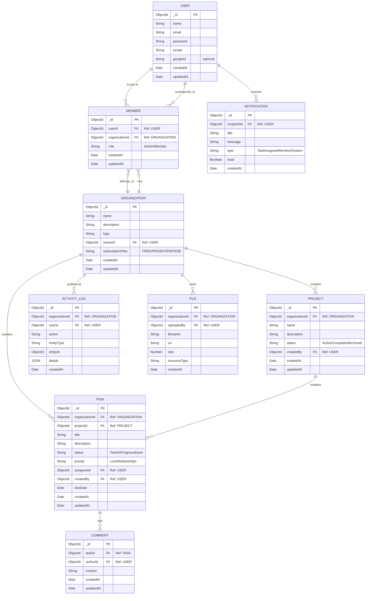

# Database Schema & ER Diagram

This document contains the Entity-Relationship (ER) Diagram for the Multi-Tenant SaaS Platform. You can view this directly if your Markdown viewer supports Mermaid.js, or copy the code block below into [Mermaid Live Editor](https://mermaid.live/).

