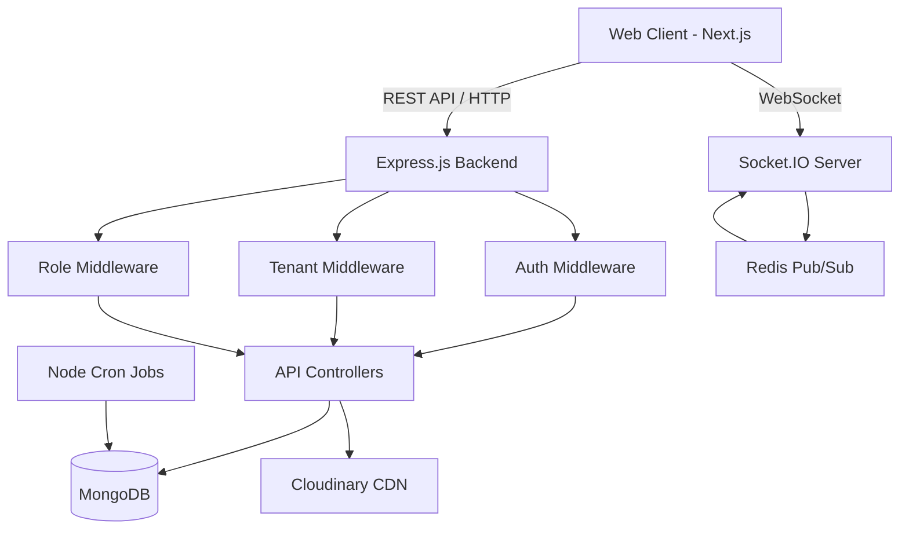

# Multi-Tenant SaaS Architecture

```mermaid
graph TD
    Client[Web Client - Next.js] -->|REST API / HTTP| API_GW[Express.js Backend]
    Client -->|WebSocket| WS_Server[Socket.IO Server]
    
    API_GW --> Auth[Auth Middleware]
    API_GW --> Tenant[Tenant Middleware]
    API_GW --> Role[Role Middleware]
    
    Auth --> Controllers[API Controllers]
    Tenant --> Controllers
    Role --> Controllers
    
    Controllers --> DB[(MongoDB)]
    Controllers --> Cloudinary[Cloudinary CDN]
    
    WS_Server --> Redis[Redis Pub/Sub]
    Redis --> WS_Server
    
    Cron[Node Cron Jobs] --> DB
```
